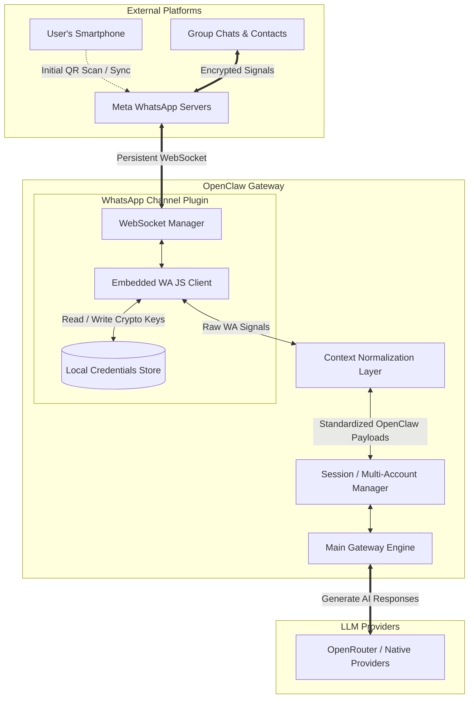

# Phase 8: WhatsApp Integration — The Omnipresent Assistant

## Phase Overview

**Big-picture goal:** Master the OpenClaw WhatsApp Web channel to seamlessly deploy your AI assistant onto the world's most ubiquitous messaging platform, ensuring robust access control, stable media handling, and continuous presence.

**What you'll understand:**
- The socket-based architecture of OpenClaw's WhatsApp Web channel integration vs polling mechanisms
- The difference between token-based authentication and QR device pairing
- Deep analysis of exhaustive JSON configuration keys (dmPolicy, groupPolicy, limits, reactions)
- How OpenClaw normalizes multi-message contexts, media wrappers, and receipts internally

**What you'll be able to do:**
- Connect a newly deployed Gateway node to WhatsApp via QR code pairing
- Construct watertight security boundaries using granular allowlists and mention gating
- Handle multimedia payloads, chunk large language model outputs, and control processing limits
- Create separate "work" and "personal" AI accounts sharing zero context but operating on the same gateway

---

## What You Need Before This Phase

- [x] Successfully completed Phase 1 (Foundation) and Phase 2 (Channels)
- [x] An active, running installation of the OpenClaw Gateway
- [x] A secondary phone number or an active WhatsApp account ready for exclusive testing purposes
- [x] Confidence in navigating and writing raw JSON within `~/.openclaw/openclaw.json` without breaking schema
- [x] Support for Markdown rendering (for viewing architectural diagrams)

---

## 8.1 The WhatsApp Web Application Architecture

### Part A — Theory & Conceptual Understanding

#### Socket Communication and Distributed State

Unlike channels such as Telegram or Discord, which provide an official API reliant on static, non-expiring Bot Tokens via HTTP polling or webhooks, WhatsApp's personal architecture fundamentally differs. It is engineered around an encrypted, end-to-end peer-to-peer connection that syncs data across Linked Devices via a continuous WebSocket. 

To bridge this, OpenClaw operates an embedded WhatsApp engine inside its plugin architecture (utilizing modern Web Socket protocols). When activated, OpenClaw simulates an entire instance of a web browser running WhatsApp Web. 
It establishes a session, decrypts messages locally, pushes them into the unified gateway bus, and manages a health-check loop to guarantee the WebSocket doesn't drop to sleep.
Because WhatsApp stores extensive state locally to handle encryption keys, the gateway generates and updates local credential stores mathematically tied to your mobile device's master session.

#### Architecture Diagram



#### The Analogy: The Embassy Outpost

**Analogy:** If the main LLM model is the "Government", the OpenClaw Gateway acts as the "Embassy". 
To operate on WhatsApp soil, the Embassy cannot just send a letter with a badge (Telegram Token). It must establish a continuous, secure, open hardline telephone (the WebSocket) back to the mainland (your phone). The Embassy staff translates the language (message normalization) and controls precisely who gets to step foot inside (access control limits). If the line drops, the embassy staff continuously attempts to redial the mainland until connection restores.

#### Theory Check

1. Why does OpenClaw require you to physically scan a QR code rather than just embedding a developer token in the config?
2. If the user's primary mobile phone drops offline, what happens to the WebSocket running inside the OpenClaw Gateway?
3. Where does OpenClaw map and store the encrypted state required to persist connections without rescanning the QR code?

---

### Part B — Hands-On: Core Initialization & Linking

**Step 1:** Download and add the WhatsApp channel module to your gateway instance.

```bash
openclaw channels add --channel whatsapp
```
*(Optionally: if running advanced node setups, `openclaw plugins install @openclaw/whatsapp` also provisions the binary packages).*

**Step 2:** Request the Gateway to initialize the socket listener, prompting the initial QR code login.

```bash
openclaw channels login --channel whatsapp
```
*Your terminal screen will render a QR code. Your gateway is halted waiting for scanning.*

**Step 3:** Open WhatsApp on your mobile device. Navigate to **Settings → Linked Devices → Link a Device**. Scan the terminal QR. 

**Step 4:** Once authorized, terminal logs will shift to displaying state syncs. Check the connection table.

```bash
openclaw channels status
```
*Expected: `WhatsApp [connected]` instead of `[awaiting_qr]`.*

#### Common Mistakes to Watch For

- **Socket Timeout / Expired QR:** A terminal QR code represents a live handshake and expires after 15–30 seconds. **Fix:** If the scan fails, press `Ctrl+C` in your terminal and rerun the login command to generate a fresh cryptographic challenge block.
- **Multi-Device Burnout:** WhatsApp has strict device limits. **Fix:** Unlink old forgotten browser sessions from your phone settings if you reach the linked devices cap.

---

## 8.2 Access Control and The Bouncer Systems

### Part A — Theory & Conceptual Understanding

#### Security Contexts

Because WhatsApp serves as your deeply personal contact network, failing to configure rules means OpenClaw will reply to your significant other, your parents, and your boss's group chats.

OpenClaw enforces multi-layer Access Control directly isolated from the model:
1. **Direct Message Policies (`dmPolicy`)**
2. **Group Chat Policies (`groupPolicy` and Mention Detection)**

The policy states are:
- `pairing`: Safest approach. Unknown senders trigger a CLI-only approval request (`openclaw pairing list whatsapp`).
- `allowlist`: Absolute firewall. Unlisted numbers are entirely bypassed.
- `open`: Extreme risk. Any inbound text triggers inference. Do not do this on a personal number.
- `disabled`: Shuts the corresponding tunnel (ignores all DMs, or ignores all groups).

#### The Analogy: The VIP Manager

**Analogy:** The Gateway is an exclusive VIP club. The config file represents instructions to the Bouncer. 
- A stranger walks up (un-allowlisted numbers): The bouncer ignores them initially. If in `pairing` mode, they take their ID and slip it under the club manager's door to sign. 
- A group of people gather outside: The bouncer won't let them interrupt the AI. The Bouncer only lets them talk if someone directly points a spotlight at the AI (`requireMention: true`).

#### Theory Check

1. If you configure `dmPolicy: "allowlist"` and an unknown number texts the assistant, does it queue in `openclaw pairing list`?
2. What role does `groupAllowFrom` play differently than the standard `allowFrom` array?
3. How does OpenClaw detect that an AI is being spoken to inside an active group chat session if explicit username tags aren't used?

---

### Part B — Hands-On: Modulating Policies

**Step 1:** Modify the JSON structure to enforce strict boundaries. Open `~/.openclaw/openclaw.json`.

```json
{
  "channels": {
    "whatsapp": {
      "dmPolicy": "allowlist",
      "allowFrom": ["+15551234567"],
      "groupPolicy": "allowlist",
      "groupAllowFrom": ["+15551234567", "+15559876543"],
      "groups": {
        "*": {
          "requireMention": true
        }
      }
    }
  }
}
```
*Note the numbers MUST contain the explicit `+` international code. The assistant will now ignore all DMs except from `...4567`, and will only respond in a group if explicitly tagged by one of the two permitted numbers.*

**Step 2:** Reload the daemon instance to enforce the firewall.

```bash
openclaw gateway restart
```

#### Common Mistakes to Watch For

- **Formatting Phone Numbers:** Adding spaces, ignoring country codes, or dropping the `+`. **Fix:** Provide exact numeric normalization like `+447712345678`.
- **Accidental Self-Triggering:** Including your identical personal smartphone number into the allowlist while you host the bot natively on the same number. OpenClaw provides `selfChatMode` implicitly, but can trap you in a bot-to-bot loop if improperly tuned.

---

## 8.3 Context Normalization and Pipeline Delivery

### Part A — Theory & Conceptual Understanding

When an LLM dictates an enormous output, the text must not break standard delivery platforms. WhatsApp has specific string constraints regarding massive messages. 

To bridge this, OpenClaw sets `textChunkLimit` (default `4000`). Crucially, if you set `chunkMode: "newline"`, the delivery script breaks parsing exactly across paragraph borders, avoiding mid-sentence cuts that destroy formatting. 

Media constitutes an edge scenario: WhatsApp supports native rich media types. Instead of passing massive byte arrays to context, OpenClaw converts files and locations into `<media:audio>` or `<media:image>` tags within the AI's standard string stream, allowing context models to parse events structurally. File sizes exceeding `mediaMaxMb` are truncated safely to preserve disk memory and prevent AI timeouts.

Furthermore, read receipts (blue ticks) can be masked fully by setting `sendReadReceipts: false`, turning the assistant into a ghost until it explicitly issues a finalized reply.

### Part B — Hands-On: Adjusting Pipeline Logistics

**Step 1:** Adapt the following properties specifically targeting the WhatsApp payload pipeline.

```json
{
  "channels": {
    "whatsapp": {
      "dmPolicy": "allowlist",
      "textChunkLimit": 3500,
      "chunkMode": "newline",
      "mediaMaxMb": 40,
      "sendReadReceipts": false,
      "historyLimit": 50
    }
  }
}
```

*This snippet guarantees:*
- The buffer chops payloads conservatively beneath 3.5k characters on newlines.
- Blocks massive image datasets (over 40mb).
- Ensures up to 50 historical messages are injected sequentially for context.
- Disables read receipts unconditionally.

**Step 2:** Trigger validation checks. 

```bash
openclaw status --all
```

---

## 8.4 Multi-Account Deployments & Visual Acknowledgments

### Part A — Theory & Conceptual Understanding

OpenClaw supports parallel separation. You may need identical configuration strategies governing completely different personas—e.g., an "internal network" developer bot and an "external" client service bot. This is handled via the `accounts` scope mapping structure. 
Providing a unique namespace allows OpenClaw to physically segregate directory maps (e.g. `~/.openclaw/credentials/whatsapp/work/creds.json`).

Separately, the LLM thought process involves inference delay. OpenClaw implements instant "acknowledgment reactions" via `ackReaction`, meaning the moment OpenClaw buffers a request from WhatsApp, the user visually observes an emoji (e.g., 👀) confirming the message didn't disappear into a void context.

### Part B — Hands-On: Parallel Execution Spaces

**Step 1:** Integrate the reactive feedback and parallel accounts format into the JSON config.

```json
{
  "channels": {
    "whatsapp": {
      "reactionLevel": "ack",
      "ackReaction": {
        "emoji": "👀",
        "direct": true,
        "group": "mentions"
      },
      "accounts": {
        "work": {
          "dmPolicy": "pairing",
          "authDir": "~/.openclaw/credentials/whatsapp/work"
        },
        "default": {
          "dmPolicy": "allowlist"
        }
      }
    }
  }
}
```

**Step 2:** Instantiate the isolated credential block using `--account`.

```bash
openclaw channels login --channel whatsapp --account work
```
*This prompts a secondary QR flow exclusively dedicated to the `work` account identifier block.*

---

## 8.5 Exhaustive `openclaw.json` Deep Dive

Beyond basic installation, the `whatsapp` node nested under `channels` exposes massive low-level configurability. Here is the explicit breakdown of all supported properties explicitly derived from `docs.openclaw.ai/configuration`.

### Security and Gatekeeping
- **`dmPolicy`**: `pairing` (CLI approvals), `allowlist` (hard wall), `open` (allow all), or `disabled` (reject all). Defaults to `pairing`.
- **`allowFrom`**: `[String]`. Exact mapping of phone numbers with country codes (e.g., `["+15555550000"]`). Ignored entirely in `open` Policy.
- **`groupPolicy`**: Defines interaction boundaries in group chats. `allowlist`, `open`, `disabled`. 
- **`groupAllowFrom`**: Valid only when `groupPolicy` is `allowlist`. Who is allowed to interact inside group environments.
- **`groups.<name>.requireMention`**: `Boolean`. Determines if the AI implicitly responds to all traffic (`false`) or strictly only when addressed with `@name` (`true`). Highly recommended `true`.

### Messaging and Normalization Pipelines
- **`textChunkLimit`**: Integer (Default `4000`). Truncation trigger length for massive text chunks.
- **`chunkMode`**: String. Evaluates to `"length"` (hard cuts midway into characters) or `"newline"` (safe paragraph boundary cutting).
- **`historyLimit`**: Integer (Default `50`). Maximum sequence of immediate prior message history injected per context turn to the LLM agent.
- **`mediaMaxMb`**: Integer (Default `50`). The megabyte threshold required to reject image or file payloads safely.
- **`sendReadReceipts`**: `Boolean`. Whether OpenClaw pushes native 'blue ticks' via the WebSocket API.

### Reaction Events
- **`reactionLevel`**: `String`. Evaluates across `"off"`, `"ack"`, `"minimal"`, `"extensive"`.
- **`ackReaction.emoji`**: Character definition (e.g. `👀`) injected pre-inference.
- **`ackReaction.direct`**: `Boolean`. Activate acknowledgments inside Personal DMs.
- **`ackReaction.group`**: Mode switch: `"mentions"` (only react to direct tags), `"always"`, or `"never"`.

### Internal Mechanics
- **`configWrites`**: `Boolean`. Permits gateway self-modifications back into JSON for state-saving mechanisms. Default `false`.
- **`actions.reactions`**: `Boolean`. Gateway authorization permitting the Agent to independently react via structured formats.
- **`actions.polls`**: `Boolean`. Gateway authorization permitting the Agent to instantiate Poll cards securely. 

---

## 8.6 Under the Hood: Memory Mapping and The Signal Protocol

### Part A — Theory & Conceptual Understanding

#### Jabber IDs and Cryptographic State

Beneath the sleek interface of WhatsApp lies a highly modified variant of XMPP (Extensible Messaging and Presence Protocol), which identifies users via JIDs (Jabber IDs). When an inbound message hits the OpenClaw WebSocket, the metadata describes the sender format using suffixes like `@s.whatsapp.net` for individual human users, or `@g.us` for group cohorts.

For example, your personal phone number `+15551234567` translates internally to the JID `15551234567@s.whatsapp.net`. OpenClaw abstracts this complexity away from the LLM, translating the raw JID into a standardized `session.dmScope` UUID mapped universally inside your `~/.openclaw/agents/main-bot/sessions` directory.

Furthermore, unlike Telegram which utilizes transport-layer cloud security natively accessible via simple REST calls, WhatsApp mandates strict End-to-End Encryption governed by the Signal Protocol. To read or write any message, the OpenClaw embedded engine (Baileys) must negotiate, rotate, and securely cache the symmetric encryption keys. This entire cryptographic state footprint is continuously serialized and persisted under the `authDir` paths within your local system.

#### The Analogy: The Codebreaker's Ledger

**Analogy:** If standard API bots use postcards (Telegram REST requests), WhatsApp Web bots trade locked briefs. Every time a message arrives, the Ambassador's Secretary (OpenClaw) must open a massive codebreaker's ledger (the `authDir/creds.json` store) to find the precise, rotating decryption key required to crack open the brief. If the ledger is lost or corrupted, the Secretary is permanently locked out of reading those briefs until they sign a brand-new cryptographic contract (rescanning the QR Code).

#### Theory Check

1. Specifically regarding the Signal Protocol architecture, why does deleting the `creds.json` file completely sever the connection to your smartphone requiring a complete QR code re-scan?
2. What are the JID suffixes utilized to distinguish between an individual Direct Message and an encapsulated Group Message inside raw network traffic?
3. How does OpenClaw map a complex `s.whatsapp.net` string into a structured standard JSONL memory persistence file mapped to an agent?

---

### Part B — Hands-On: Investigating Cryptographic and Session Storage Logs

**Step 1:** While the WhatsApp link is active, open a secondary terminal to inspect the internal cryptographic store OpenClaw generates to emulate the browser session.

```bash
ls -la ~/.openclaw/credentials/whatsapp/default
```
*You will likely notice an extensive list of files including `creds.json`, `app-state-sync-version` databases, and `pre-key` structures. These files represent the heavy local persistence required to maintain a seamless Signal Protocol loop. Do not modify these. If they become corrupt, OpenClaw gracefully generates a `.bak` backup.*

**Step 2:** Next, observe how OpenClaw maps a raw WhatsApp JID into a functional LLM tracking state by reading the local agent's live session index.

```bash
ls -la ~/.openclaw/agents/main-bot/sessions/ | grep whatsapp
```
*You will see the normalized log files formatted similar to `agent:main-bot:whatsapp:group:12345678@g.us.jsonl` or `agent:main-bot:whatsapp:personal:888@s.whatsapp.net.jsonl`. OpenClaw seamlessly bridges the rigid cryptography layers straight into standardized LLM context arrays.*

#### Common Mistakes to Watch For

- **Manual Deletion of Single Crypto Keys:** Thinking you can "reset" a bugged connection by deleting just the `app-state` databases but leaving `creds.json`. **Fix:** If the channel connection irrecoverably fails or enters a decrypt loop, permanently terminate the entire session safely via `openclaw channels logout --channel whatsapp` and rescan the complete cryptographic pipeline sequence.
- **Accidental Permission Drops:** Moving OpenClaw folders around via `sudo` commands altering root ownerships. When OpenClaw subsequently restarts running on your local user space, it will fail to read `creds.json` natively triggering a silent crash loop.

---

## 8.7 Additional Tool Integrations and Action Gates

### Part A — Theory & Conceptual Understanding

#### Exposing Interactive UI Elements

Messaging applications are evolving beyond static text. Modern WhatsApp supports interactive cards, native polls, and specific message reactions. By default, OpenClaw attempts to sanitize highly interactive or potentially disruptive behaviors across the gateway to prevent runaway agents from spamming UI events.

However, OpenClaw explicitly supports two major Action Gates for WhatsApp:
1. **Polls:** The ability for an agent to natively generate a multi-choice UI element directly in your chat for interaction.
2. **Reactions:** Empowering the agent to drop native emojis directly onto *your* messages purely as a tool-use response, distinct from the `ackReaction` which is system-level.

These actions fall under the tool integrations module and must be explicitly enabled inside the `openclaw.json` file. If disabled, any LLM tool-calling attempt regarding these endpoints is safely ignored by the gateway translator.

#### The Analogy: The Toolkit Permissions

**Analogy:** The Ambassador (your Agent) has a massive toolkit. By default, they are only allowed to use the basic typewriter (text messaging). If you want the Ambassador to start handing out interactive surveys (Polls) or sticking gold stars on public documents (Reactions), you have to explicitly unlock that part of the toolkit in the Embassy guidelines. 

#### Theory Check

1. Why might you want to permanently disable `actions.polls` for an agent operating in a busy group chat?
2. What is the distinction between `ackReaction` and `actions.reactions`? Which one does the LLM actively decide to use?

---

### Part B — Hands-On: Authorizing Action Gates

**Step 1:** Modify the JSON structure to unlock the interactive Tool actions for WhatsApp.

```json
{
  "channels": {
    "whatsapp": {
      "dmPolicy": "pairing",
      "actions": {
        "reactions": true,
        "polls": true
      }
    }
  }
}
```
*Setting these to `true` allows the `react` and `poll` tools to surface directly to the primary LLM model during its tool-gathering phase.*

**Step 2:** Reload the daemon interface to merge the updated schema capabilities into the LLM logic router.

```bash
openclaw gateway restart
```

#### Common Mistakes to Watch For

- **Confusing Ack with Actions:** Assuming `reactions: true` means OpenClaw will automatically use the `ackReaction` feature. **Fix:** Ensure you cleanly understand that `actions` empower the Agent's decision-making natively within the context prompt, while `ackReaction` is a mechanical gateway-level visual confirmation separate from the Language Model.

---

## Phase 8 Projects

---

### Project 8: "The Executive Omni-Bot" — Deploy an Ironclad Enterprise Account

#### Theory Recap
Applies theories from Section 8.1 (WebSocket Connection State), 8.2 (Gatekeeper Access Control), 8.3 (Pipeline Normalization), and 8.5 (Exhaustive Configurability).

#### What You'll Build
You will write an enterprise-level setup inside the Gateway configuration. This WhatsApp endpoint will exclusively converse with an authorized executive team, manage lengthy reports, hide read receipts, react immediately upon receipt, and block media ingestion. 

#### What You'll Learn
- Translating theoretical JSON configuration definitions into hardened operational scopes.
- Observing dynamic logging related to connection synchronization (`openclaw logs --follow`).

#### Prerequisites
- A freshly initialized Gateway environment.
- Completion of the OpenClaw configuration theories.

#### Step-by-Step Build Guide

1. **Deploy JSON config via Terminal Text Editor:**
   Open your environment setup file securely.
   ```bash
   nano ~/.openclaw/openclaw.json
   ```
   Add exactly this definition under the broader `channels` segment:
   ```json
   {
     "channels": {
       "whatsapp": {
         "enabled": true,
         "dmPolicy": "allowlist",
         "allowFrom": ["+12025550198", "+12025550199"],
         "groupPolicy": "disabled",
         "textChunkLimit": 2000,
         "chunkMode": "newline",
         "sendReadReceipts": false,
         "mediaMaxMb": 5,
         "reactionLevel": "ack",
         "ackReaction": {
           "emoji": "🛠️",
           "direct": true,
           "group": "never"
         },
         "historyLimit": 20
       }
     }
   }
   ```
   
2. **Reload Processes & Bind the Agent:**
   Cycle the runtime container.
   ```bash
   openclaw gateway restart
   ```

3. **QR Activation:**
   Engage the binding process directly utilizing the core native profile.
   ```bash
   openclaw channels login --channel whatsapp
   ```

#### How to Test It
- ✅ Message the number from an unregistered phone. Ensure the Gateway completely obfuscates any response in the background logs and does not reply.
- ✅ Message the number from `+12025550198`. Validate that a `🛠️` emoji instantaneously appears on your specific message.
- ✅ Send a deliberately long command forcing the AI into heavy output. Validate that the response neatly arrives chopped via newline segmentation.
- ✅ Ask the AI a request while providing a massive 50MB video file. Validate the agent gracefully returns a rejection regarding byte constraints avoiding the API lockup.

#### Common Pitfalls
- **Accidentally running "open" policy:** JSON syntax collisions can drop security boundaries. **Fix:** Be absolutely vigilant with syntax alignment. Audit configs via `openclaw status`.
- **Emoji Render Failure:** Using complex ZWJ (Zero-Width-Joiner) emojis that older iOS/Android devices fail to map seamlessly. **Fix:** Specify legacy-safe, system-standard simple unicode emojis for your `ackReaction`.

#### Stretch Goals
1. Extrapolate an entirely secondary configuration subset utilizing the `"accounts": {"developer_test": {...}}` architecture mapping. Switch the target `groupPolicy` to `"allowlist"` and expand `groupAllowFrom` constraints. Leverage `--account developer_test` to operate an isolated sub-instance simultaneously without contaminating the Executive environment block.

---

## Troubleshooting Connectivity & Edge Cases

When deploying sockets compared to stateless tokens, unpredictable behaviors arise regarding networking environments.

**"The QR code renders incredibly mangled in the terminal."**
**Cause:** Conflicting ANSI text encodings inside minimal SSH sessions ignoring background color blocks.
**Fix:** Swap terminal rendering environments natively or utilize light-on-dark standard VT100 terminals.

**"The Gateway constantly loops between Connected and Reconnecting..."**
**Cause:** Multi-Device limitations or an active background instance of WhatsApp Web open on your desktop forcibly bumping the engine off the socket.
**Fix:** Run `openclaw channels logout --channel whatsapp`, close background browser tabs of WhatsApp Web, and execute a fresh `channels login`. 

---

## Phase 8 — End of Phase Review

### Conceptual Recap Questions

1. Defend the distinction between "allowlist" and "pairing" `dmPolicy` implementations targeting public phone deployments. Why is one drastically superior exclusively for development stages?
2. How does OpenClaw map inbound media resources across a web socket protocol down into textual markup representations that an LLM understands safely?
3. Contrast the limitations presented regarding WhatsApp context injections (`historyLimit`) versus standard memory state persistence structures. 

### Practical Consolidation Challenge

**"The Firewall Post-Mortem"**: Due to an unintentional JSON typo, an OpenClaw iteration initialized with an `"open"` policy resulting in multiple unknown inbound conversational triggers over the last 48 hours. Using purely terminal applications, cycle the daemon offline securely, correct the runtime `openclaw.json` boundaries towards strict gating, purge the compromised active sessions operating inside the local persistent memory cache (`~/.openclaw/agents/main-bot/sessions/`), and resurrect the primary container. Upon boot, exhibit utilization of `openclaw doctors` to confirm boundary integrity returns to zero-trust levels.
