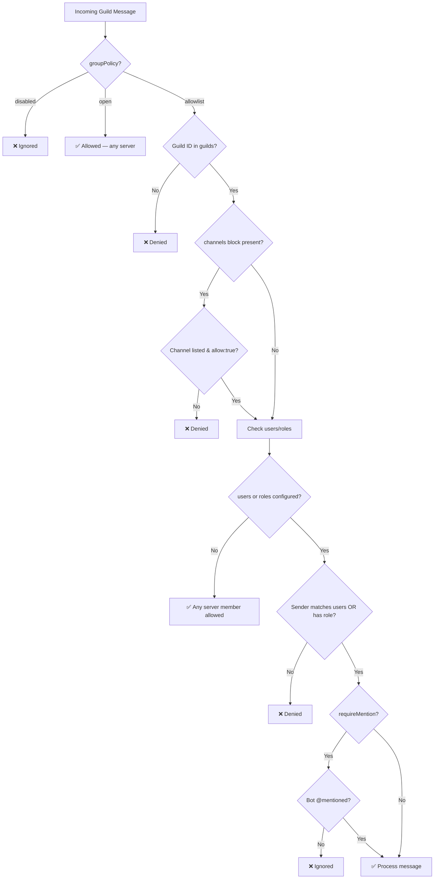

# OpenClaw Discord Channel — Complete Configuration Reference

> **Source**: [docs.openclaw.ai/channels/discord](https://docs.openclaw.ai/channels/discord) (fetched 2026-04-01)
> **GitHub**: [extensions/discord/src/](https://github.com/openclaw/openclaw/tree/main/extensions/discord/src) · [src/config/types.discord.ts](https://github.com/openclaw/openclaw/blob/main/src/config/types.discord.ts)

---

## 1. Prerequisites

| Requirement | Details |
|---|---|
| Discord Server | [Create one](https://support.discord.com/hc/en-us/articles/204849977-How-do-I-create-a-server) if you don't have one |
| Discord App + Bot | [Developer Portal](https://discord.com/developers/applications) → New Application → Bot → Add Bot |
| Privileged Intents | **Message Content Intent** (required), **Server Members Intent** (recommended), Presence Intent (optional) |
| OAuth Scopes | `bot`, `applications.commands` |
| Bot Permissions | View Channels, Send Messages, Read Message History, Embed Links, Attach Files, Add Reactions (optional) |
| Developer Mode | User Settings → Advanced → **Developer Mode ON** |
| IDs Collected | **Server ID** (right-click server icon), **User ID** (right-click your avatar) |

---

## 2. Minimal Config — Enable Discord

In `~/.openclaw/openclaw.json`:

```jsonc
{
  "channels": {
    "discord": {
      "enabled": true,
      "token": {
        "source": "env",
        "provider": "default",
        "id": "DISCORD_BOT_TOKEN"
      }
    }
  }
}
```

Set the env var before starting the Gateway:

```bash
export DISCORD_BOT_TOKEN="YOUR_BOT_TOKEN"
openclaw gateway run
```

> [!IMPORTANT]
> Never put your bot token directly in `openclaw.json` — always use a `{ source: "env", ... }` reference. See [Secrets Management](https://docs.openclaw.ai/gateway/secrets).

---

## 3. DM Pairing (Initial Access)

After the gateway starts, DM the bot. It returns a pairing code.

```bash
openclaw pairing list discord
openclaw pairing approve discord <CODE>
```

Default DM policy is `pairing` — only paired users can interact.

---

## 4. `channels.discord.guilds` — The Guild Allowlist

This is the **core access-control mechanism** for Discord servers (guilds). It controls which servers, channels, users, and roles can interact with your bot.

### 4.1 Enabling the Guild Allowlist

```jsonc
{
  "channels": {
    "discord": {
      "groupPolicy": "allowlist",   // ← Activates the guild allowlist
      "guilds": {
        "YOUR_SERVER_ID": {
          // per-guild config here
        }
      }
    }
  }
}
```

`groupPolicy` values:
| Value | Behavior |
|---|---|
| `"open"` | Bot responds in **any** server it's added to |
| `"allowlist"` | Bot **only** responds in servers listed under `guilds` |
| `"disabled"` | Bot **ignores** all guild/server messages |

> [!CAUTION]
> The default `channels.defaults.groupPolicy` is `"open"`. For production, always set `groupPolicy: "allowlist"` and explicitly list your server(s).

---

### 4.2 Per-Guild Configuration Keys

Each guild entry (`guilds.YOUR_SERVER_ID`) supports:

```jsonc
{
  "channels": {
    "discord": {
      "groupPolicy": "allowlist",
      "guilds": {
        "123456789012345678": {

          // ── Mention control ──
          "requireMention": true,          // Bot only replies when @mentioned
          "ignoreOtherMentions": true,     // Ignore msgs that @mention other users/bots

          // ── User allowlist (optional) ──
          "users": [
            "987654321098765432"           // Discord User IDs (stable, recommended)
          ],

          // ── Role allowlist (optional) ──
          "roles": [
            "111111111111111111"           // Discord Role IDs only
          ],

          // ── Channel restrictions (optional) ──
          "channels": {
            "general": {
              "allow": true
            },
            "help": {
              "allow": true,
              "requireMention": true       // Per-channel mention override
            }
          }
        }
      }
    }
  }
}
```

### 4.3 Key Reference Table

| Key Path | Type | Default | Description |
|---|---|---|---|
| `channels.discord.enabled` | `boolean` | `false` | Enable/disable the Discord channel |
| `channels.discord.token` | `object` | — | Bot token reference (`{ source, provider, id }`) |
| `channels.discord.groupPolicy` | `string` | `"open"` | `"open"` / `"allowlist"` / `"disabled"` |
| `channels.discord.guilds` | `object` | `{}` | Map of Server ID → guild config |
| `guilds.<id>.requireMention` | `boolean` | `false` | Require @mention to trigger response |
| `guilds.<id>.ignoreOtherMentions` | `boolean` | `false` | Ignore messages mentioning others |
| `guilds.<id>.users` | `string[]` | `[]` | User ID allowlist (OR with roles) |
| `guilds.<id>.roles` | `string[]` | `[]` | Role ID allowlist (OR with users) |
| `guilds.<id>.channels` | `object` | — | Per-channel allow/deny + overrides |
| `guilds.<id>.channels.<name>.allow` | `boolean` | — | Allow this channel |
| `guilds.<id>.channels.<name>.requireMention` | `boolean` | — | Override mention setting for this channel |
| `channels.discord.dmPolicy` | `string` | `"pairing"` | `"pairing"` / `"allowlist"` / `"open"` / `"disabled"` |
| `channels.discord.allowFrom` | `string[]` | `[]` | DM allowlist (`"user:<id>"` or `"*"`) |
| `channels.discord.dm.groupEnabled` | `boolean` | `false` | Enable group DMs |
| `channels.discord.dm.groupChannels` | `string[]` | `[]` | Specific group DM channel IDs/slugs |
| `channels.discord.dangerouslyAllowNameMatching` | `boolean` | `false` | Allow name/tag matching (insecure, break-glass only) |
| `channels.discord.commands.native` | varies | `"auto"` | Override native slash command registration |

---

### 4.4 Access Logic Flow



---

## 5. DM Policy Reference

| Key | Value | Behavior |
|---|---|---|
| `channels.discord.dmPolicy` | `"pairing"` (default) | New DMs trigger a pairing code; only approved users can chat |
| | `"allowlist"` | Only users in `channels.discord.allowFrom` can DM |
| | `"open"` | Any Discord user can DM (requires `allowFrom: ["*"]`) |
| | `"disabled"` | No DM interaction at all |

DM allowlist format:
```jsonc
{
  "channels": {
    "discord": {
      "dmPolicy": "allowlist",
      "allowFrom": ["user:987654321098765432"]
    }
  }
}
```

---

## 6. Session Model

| Context | Session Key Format |
|---|---|
| DM (default `dmScope=main`) | `agent:main:main` (shared with other channels) |
| Guild channel | `agent:<agentId>:discord:channel:<channelId>` (isolated) |
| Slash command | `agent:<agentId>:discord:slash:<userId>` (isolated) |
| Group DM | Ignored by default (`dm.groupEnabled=false`) |

> [!NOTE]
> Guild channels are **automatically isolated** — each channel gets its own session. This prevents cross-channel context leakage.

---

## 7. Role-Based Agent Routing

Route different agents to different guilds/roles using `bindings`:

```jsonc
{
  "bindings": [
    {
      "agentId": "opus",
      "match": {
        "channel": "discord",
        "guildId": "123456789012345678",
        "roles": ["111111111111111111"]
      }
    },
    {
      "agentId": "sonnet",
      "match": {
        "channel": "discord",
        "guildId": "123456789012345678"
      }
    }
  ]
}
```

- More specific matches (with `roles`) take priority
- Fallback bindings (without `roles`) catch everyone else in that guild

---

## 8. Forum Channels

```bash
# Auto-create a thread (title = first line of message)
openclaw message send --channel discord --target channel:<forumId> \
  --message "Topic title\nBody of the post"

# Explicit thread creation
openclaw message thread create --channel discord --target channel:<forumId> \
  --thread-name "Topic title" --message "Body of the post"
```

Reply to an existing thread using `channel:<threadId>`.

---

## 9. Native Slash Commands

| Key | Default | Description |
|---|---|---|
| `commands.native` | `"auto"` | Auto-registers slash commands for Discord |
| `channels.discord.commands.native` | — | Per-channel override |
| `commands.native=false` | — | Clears previously registered commands |

- Auth uses the **same** allowlists/policies as normal messages
- Commands may be visible in UI for unauthorized users, but execution is denied

---

## 10. Interactive Components

Discord supports Components v2 UI via `components` in tool actions:

| Block Type | Description |
|---|---|
| `text` | Rich text content |
| `section` | Grouped content |
| `separator` | Visual divider |
| `actions` | Buttons (up to 5) or select menu |
| `media-gallery` | Multiple files |
| `file` | Single attachment (`attachment://<filename>`) |

Select types: `string`, `user`, `role`, `mentionable`, `channel`

Modals: up to 5 fields (`text`, `checkbox`, `radio`, `select`, `role-select`, `user-select`)

```jsonc
{
  "channel": "discord",
  "action": "send",
  "to": "channel:123456789012345678",
  "components": {
    "reusable": true,
    "blocks": [
      {
        "type": "actions",
        "buttons": [
          { "label": "Approve", "style": "success", "allowedUsers": ["123456789012345678"] },
          { "label": "Decline", "style": "danger" }
        ]
      }
    ]
  }
}
```

---

## 11. Voice Channels & Messages

- **Voice channels**: The bot can join voice channels in allowlisted guilds
- **Voice messages**: Received and processed like regular audio attachments

Source: [extensions/discord/src/voice/](https://github.com/openclaw/openclaw/tree/main/extensions/discord/src/voice)

---

## 12. Security Best Practices

| Practice | Implementation |
|---|---|
| Never use `groupPolicy: "open"` in production | Set `groupPolicy: "allowlist"` |
| Use IDs not names | `users: ["123..."]` not usernames — names can change |
| Avoid `dangerouslyAllowNameMatching` | Only as break-glass; `openclaw security audit` warns when active |
| Restrict channels when possible | Use the `channels` sub-block to limit which channels the bot responds in |
| Use role-based access | Combine `users` + `roles` for fine-grained control |
| Audit regularly | `openclaw security audit --deep` flags name-matching and overly-broad configs |

---

## 13. Complete Production Config Example

```jsonc
{
  "channels": {
    "discord": {
      "enabled": true,
      "token": {
        "source": "env",
        "provider": "default",
        "id": "DISCORD_BOT_TOKEN"
      },

      // ── DM Security ──
      "dmPolicy": "pairing",

      // ── Guild Security ──
      "groupPolicy": "allowlist",
      "guilds": {
        "YOUR_SERVER_ID": {
          "requireMention": true,
          "ignoreOtherMentions": true,
          "users": ["YOUR_USER_ID"],
          "roles": ["TRUSTED_ROLE_ID"],
          "channels": {
            "general": { "allow": true },
            "ai-chat": { "allow": true, "requireMention": false },
            "admin": { "allow": true, "requireMention": true }
          }
        }
      }
    }
  }
}
```

---

## 14. Troubleshooting Quick-Reference

| Issue | Cause | Fix |
|---|---|---|
| Bot doesn't respond in server | `groupPolicy` is not `"allowlist"` or guild ID missing | Add server ID to `guilds` |
| Bot doesn't respond to DM | DM not paired or `dmPolicy: "disabled"` | Run `openclaw pairing approve discord <CODE>` |
| Bot only responds when @mentioned | `requireMention: true` is set | Set `requireMention: false` for that guild/channel |
| Bot responds to everyone | No `users`/`roles` filters | Add user/role allowlists |
| Slash commands visible but denied | Auth is enforced at execution, not visibility | Expected behavior — unauthorized users see "not authorized" |
| Name-matching warnings | Using usernames instead of IDs | Switch to numeric IDs |

---

## 15. Source File Map (GitHub)

| File | Purpose |
|---|---|
| [`extensions/discord/src/guilds.ts`](https://github.com/openclaw/openclaw/blob/main/extensions/discord/src/guilds.ts) | Guild allowlist resolution and matching |
| [`extensions/discord/src/group-policy.ts`](https://github.com/openclaw/openclaw/blob/main/extensions/discord/src/group-policy.ts) | Group policy enforcement (`open`/`allowlist`/`disabled`) |
| [`extensions/discord/src/channel.ts`](https://github.com/openclaw/openclaw/blob/main/extensions/discord/src/channel.ts) | Main Discord channel implementation |
| [`extensions/discord/src/resolve-users.ts`](https://github.com/openclaw/openclaw/blob/main/extensions/discord/src/resolve-users.ts) | User ID/name resolution for allowlists |
| [`extensions/discord/src/resolve-channels.ts`](https://github.com/openclaw/openclaw/blob/main/extensions/discord/src/resolve-channels.ts) | Channel slug/ID resolution |
| [`extensions/discord/src/setup-core.ts`](https://github.com/openclaw/openclaw/blob/main/extensions/discord/src/setup-core.ts) | Bot setup and connection logic |
| [`src/config/types.discord.ts`](https://github.com/openclaw/openclaw/blob/main/src/config/types.discord.ts) | TypeScript type definitions for Discord config schema |
| [`extensions/discord/src/voice/`](https://github.com/openclaw/openclaw/tree/main/extensions/discord/src/voice) | Voice channel support |
| [`extensions/discord/src/monitor/`](https://github.com/openclaw/openclaw/tree/main/extensions/discord/src/monitor) | Message handler, native commands, gateway plugin |

---

> **Verified against**: [docs.openclaw.ai/channels/discord](https://docs.openclaw.ai/channels/discord) and [github.com/openclaw/openclaw](https://github.com/openclaw/openclaw) — fetched 2026-04-01
